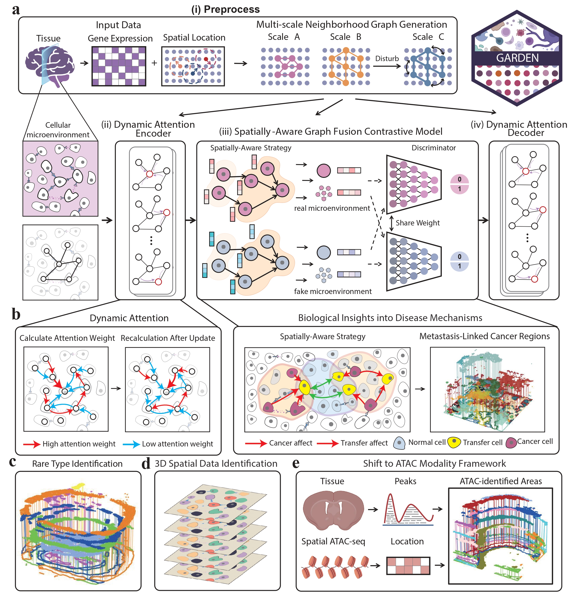

# Robust Characterization and Interpretation of Rare Pathogenic Cell Populations from Spatial Omics using GARDEN
[](https://doi.org/10.5281/zenodo.17936254)
--- 
## 1. Overview
`GARDEN` is a Python package for quantitative characterization and interpretation of rare spatial heterogeneity from spatial omics data.



---
## 2. Installation & Environment Setup

**Note:** Before using the `mclust` algorithm, ensure that the `mclust` package is installed in R and that `os.environ['R_HOME']` is configured with the correct path by following these steps:

1. **Create and activate a new conda environment:**
   ```bash
   conda create -n GARDEN_env python=3.8
   conda activate GARDEN_env
   ```

2. **Install R and necessary packages:**
   ```bash
   conda install r-base
   pip install rpy2==3.4.1
   R --quiet --no-restore
   install.packages('mclust')
   ```

3. **Clone the GARDEN repository and install dependencies:**
   ```bash
   git clone git@github.com:Briskzxm/GARDEN.git
   cd <Path_to_GARDEN>
   python setup.py build
   python setup.py install 
   pip install -r requirements.txt
   ```

4. **Optional – Manual installation of PyTorch Geometric dependencies:**
   If you encounter issues installing `torch_sparse`, `torch_scatter`, `torch_cluster`, or `torch_geometric`, manually download the corresponding `.whl` files from [PyTorch Geometric WHL](https://pytorch-geometric.com/whl/) and install them:
   ```bash
   pip install <file_name>.whl
   ```

---

## 3. Quick Start

### Input Data
The input files can be in various formats, with `h5ad` being a typical example containing spatial transcriptomics data. Spatial coordinates are usually stored in `adata.obsm['spatial']`. We use the `scanpy` library to read and process such data, which enables convenient access to spatial information and gene expression matrices.

```python
# Import necessary libs
import scanpy as sc
from GARDEN import GARDEN

# Read the h5ad file
file_path = '/home/user/data/spatial_data.h5ad'
adata = sc.read(file_path)
```

### Model Definition and Training
- Direct Training on Full Dataset
```python
# Define the model
model = GARDEN.GARDEN(adata, device=device)
# Train the model
adata = model.train()
```

- Batch Training for Large Dataset
```python
# Define the batch training model
model = GARDEN.GARDEN_Batch(adata, datatype='HD')
# Train the model
adata = model.train_expand(batch_number=10)
```

### Clustering
After training, apply clustering algorithms such as `mclust` or `leiden`:
```python
# Import clustering functions
from GARDEN.utils import clustering
# Clustering results are stored in adata.obs['domain']
clustering(adata, n_clusters)
```
### Alignment
- Define Alignment Model and Train

```python
# Import necessary libs and read data.
from GARDEN_Align import *
adata1 = sc.read('slice1.h5ad')
adata2 = sc.read('slice2.h5ad')

# Define align model and train model 
# Args should be configured before running. See the tutorial for details.
model = GARDEN_Align(adata1,adata2,args)
out1,out2,similarity = model.train()
```
- Obtaining Aligned Coordinates by Affine Transforming Slice Coordinates

```python
# By default, only rotates the first adata.
adata1_aligned = align_slice(adata1, adata2, pis = similarity)
```


### Optional - Direct Script Execution
We also provide convenient Python scripts for direct execution. You can run the entire pipeline with a single command in your terminal:

```bash
# Clustering
python run_garden.py
# Alignment
python run_garden_alignment.py 
```

#### Execution Order Note
You can adjust the order of script execution based on your analysis needs:
- For **clustering first, then alignment**, first run `run_garden.py`, then `run_garden_alignment.py`.
- For **alignment first, then clustering**, first run `run_garden_alignment.py`, then `run_garden.py`.

---
## 4. Step-by-Step Tutorials

We provide step-by-step tutorials in the `Tutorial` folder to help users get started. Each tutorial is designed as a self-contained Jupyter notebook with example datasets that download automatically.

### Tutorial Descriptions

- **`Visium.ipynb`** – Demonstrates the complete clustering workflow for standard 10x Visium data, from data preprocessing to visualization of spatial domains.

- **`8month_control/disease.ipynb`** – Guides you through clustering high-resolution in situ sequencing data, highlighting adaptations for higher spatial resolution datasets.

- **`Xenium_BRCA.ipynb`** – Demonstrates methods for batch-training on Xenium human breast cancer (BRCA) spatial transcrptomics dataset.


- **`Alignment-Visium.ipynb`** – Demonstrates methods for aligning multiple spatial transcriptomics datasets generated with 10x Genomics Visium, enabling comparative analysis across different conditions or experiments.

- **`Alignment-STARmap PLUS.ipynb`** – Demonstrates alignment techniques for spatial omics datasets obtained using STARmap PLUS, facilitating systematic comparison across technologies or experimental conditions.

---

## 5. Reproducible Analysis

To ensure the transparency and reproducibility of our findings, we provide complete analysis scripts that regenerate the key results and figures presented in the manuscript. These scripts utilize publicly accessible datasets and are organized in the `Reproducible_Analysis/` directory.


### Modular Analysis Workflows
We provide task-specific Python and R scripts for essential spatial omics analyses:

- `Cell-network.R` – Visualizes spatial proximity between two cell types using **MERINGUE**.

- `Coappear.py` – Computes cluster co-occurrence probabilities using **squidpy**.

- `LR-analysis.py` – Performs receptor–ligand interaction analysis using **squidpy**.

- `Deconvolution.py` – Deconvolves spatial spots using **GraphST** to recover cell-type identities.

- `Tangram.py` – Maps single-cell data onto spatial data using **Tangram**.

- `Cell_Cell_Communication.py` – Identifies inter-cluster ligand–receptor interactions using **CellChat**.

- `Trajectory.py` – Infers spatial trajectories using **VIA**.

- `Hotspot.py` – Identifies spatial gene modules and hotspots using **Stereopy**.

- `Spateo-3D.py` – Reconstructs and visualizes 3D tissue architecture using **Spateo**.

- `CSI-heatmap.py` – Visualizes Connection Specificity Index between transcription factors.

- `Correlation.R` – Calculates correlation between proportions of spots occupied by two cell types.


---

## 6. License
This project is covered under the **MIT License**.
